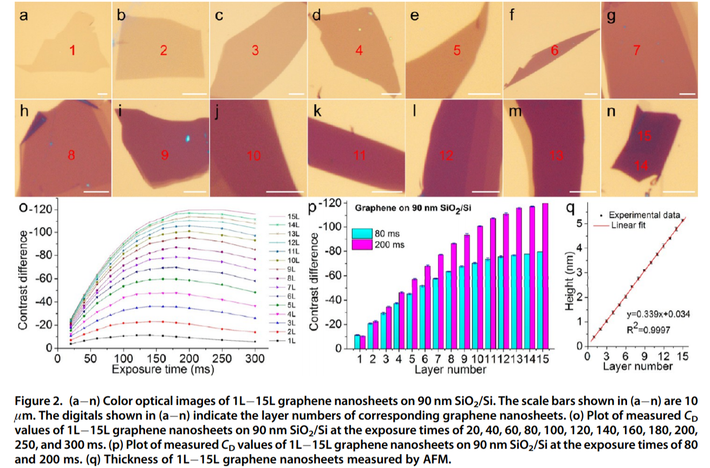
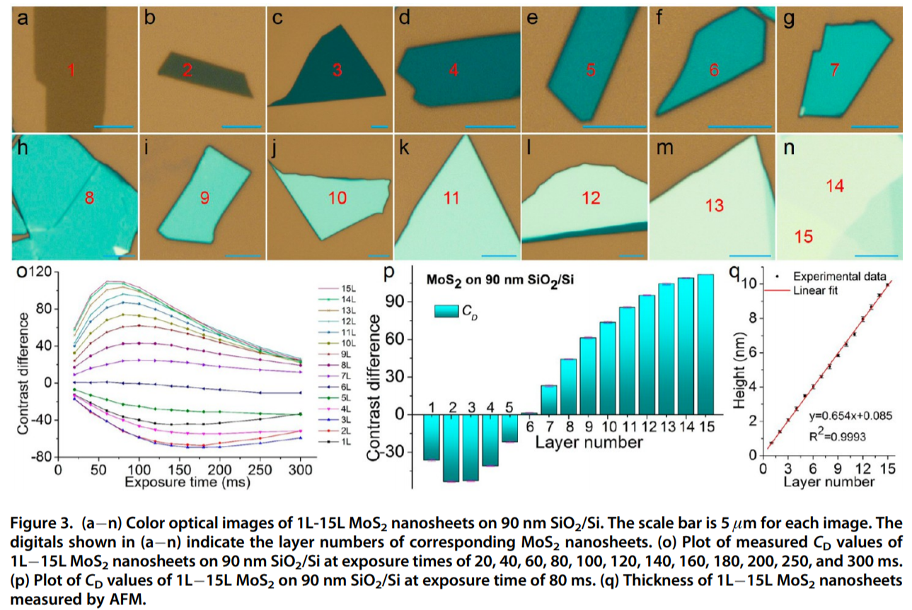
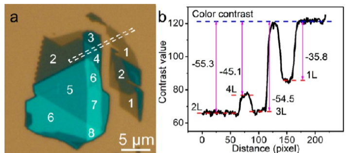
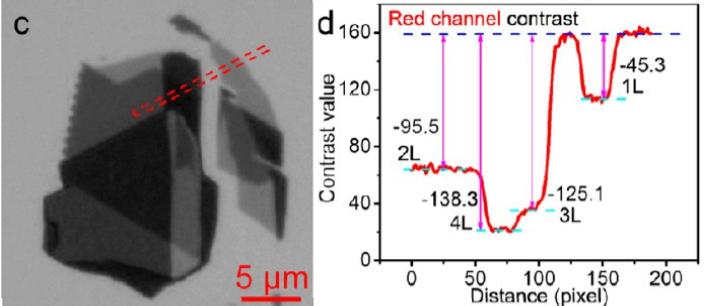
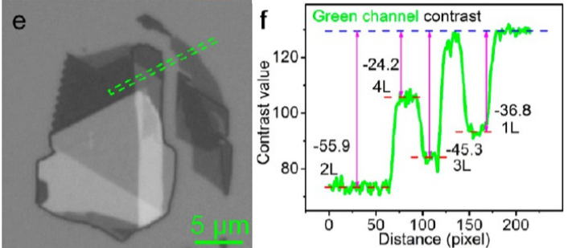
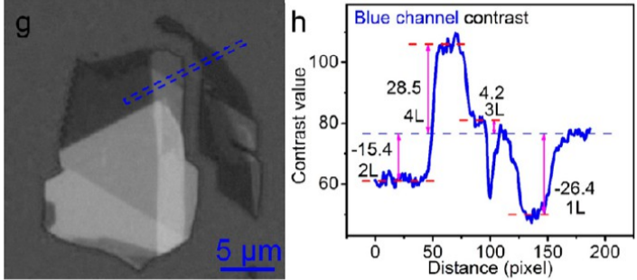
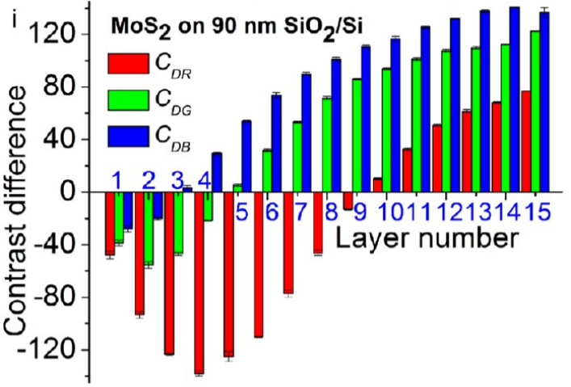
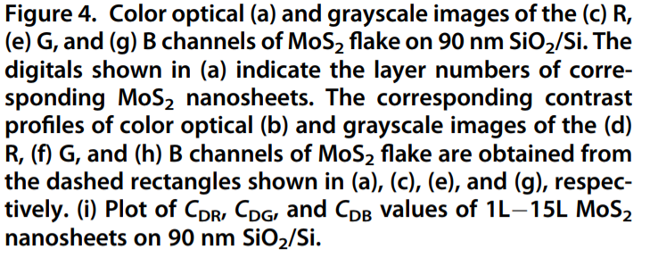
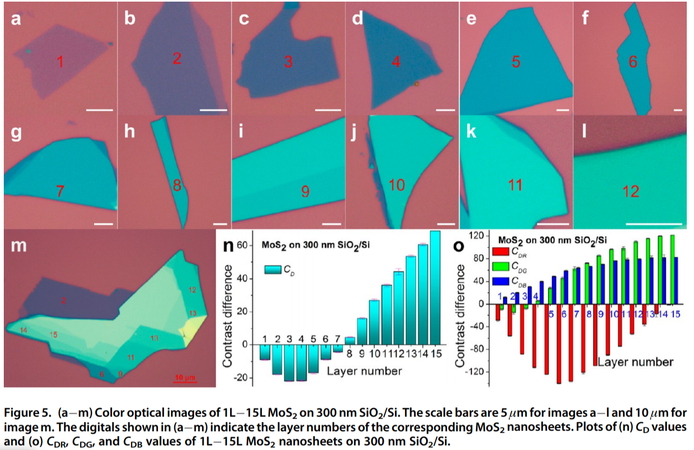

<!-- Center image on slide -->

## Outline

1. **Introduction**
  - Transition Metal Dichalcogenides (**TMDCs**)  
2. **Methods**
3. **Experiment**
4. **Results & Discussion**
5. **Conclusion**
6. **Q&A**

--- .class #id

## Introduction
### **Transition Metal Dichalcogenides (TMDCs)** 
TMDCs are thin semiconductors of the type MX$_{2}$, with **M** as a transition metal atom (Mo, W, etc.) and **X** as a **chalcogen** atom (S, Se, or Te).  

### **Monolayers of TMDCs**
- Having Direct band gap can be used in electronics as transistors and in optics as emitter or detector
  - MoS$_{2}$, WS$_{2}$, MoSe$_{2}$, WSe$_{2}$, MoTe$_{2}$
- TMD monolayers has no inversion center, which allow to access a new dgree of freedom of charge carrier, namely the **k-valley** index
  - **+K** valley and **-K** valley
- The strong spin-orbit coupling in TMD monolayers

###### [Transition metal dichalcogenide monolayers on Wikipedia](https://en.wikipedia.org/w/index.php?title=Transition_metal_dichalcogenide_monolayers&oldid=891064104) (last visited June 3, 2019).

--- .class #id

## Experiments
### Description of the Optical Identification Method

1. C$_{D}$ = C - C$_{S}$
2. C$_{DR}$ = C$_{R}$ - C$_{SR}$
3. C$_{GR}$ = C$_{G}$ - C$_{SG}$
4. C$_{DB}$ = C$_{B}$ - C$_{SB}$

The optical contrast of a nanosheet (defined as C) and substrate (defined as C$_{S}$) was directly measured from its color optical image by using a free software (`ImageJ`)

###### H. Li, J. Wu, X. Huang, G. Lu, J. Yang, X. Lu, Q. Xiong, and H. Zhang, *ACS Nano* **7**, 10344 (2013).

--- &twocol w1:40% w2:60%

*** =left

*** =right

    
### The contrast values with different poistions
| Layers | Contrast |
| ------ | -------- |
| 0 substracte | 120.4 |
| 6 layers | 118.6 |
| 8 layers | 162.3 |

###### H. Li, J. Wu, X. Huang, G. Lu, J. Yang, X. Lu, Q. Xiong, and H. Zhang, *ACS Nano* **7**, 10344 (2013).

---

### Optical Identification of Graphene Nanosheets

###### H. Li, J. Wu, X. Huang, G. Lu, J. Yang, X. Lu, Q. Xiong, and H. Zhang, *ACS Nano* **7**, 10344 (2013).

---

### Optical Identification of MoS2 Nanosheets

###### H. Li, J. Wu, X. Huang, G. Lu, J. Yang, X. Lu, Q. Xiong, and H. Zhang, *ACS Nano* **7**, 10344 (2013).

--- &twocol w1:50% w2:50%

*** =left

*** =right
   
   

###### H. Li, J. Wu, X. Huang, G. Lu, J. Yang, X. Lu, Q. Xiong, and H. Zhang, *ACS Nano* **7**, 10344 (2013).

---

###### H. Li, J. Wu, X. Huang, G. Lu, J. Yang, X. Lu, Q. Xiong, and H. Zhang, *ACS Nano* **7**, 10344 (2013).

---

## Conclusion

---

  
  
  
  

     Thank you for your attention!

