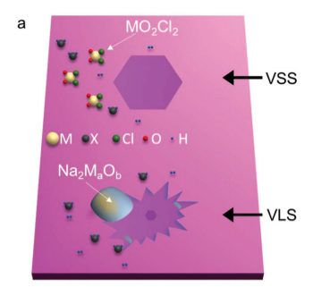

## Outline

1. **Introduction**
  - Transition Metal Dichalcogenides (**TMDCs**)  
2. **Experiment**
3. **Results**
4. **Discussion**
5. **Q&A**

--- .class #id

## Introduction
### Transition Metal Dichalcogenides (TMDCs) 
In a typical CVD synthesis, a transition metal containing precursor is placed in a tube furnace with a chalcogen precursor and a target substrate.

--- .class #id

## Experiments
<!-- Limit image width and height -->

<!-- Center image on slide -->

###### 
*Nanoscale*, 2019, **11**, 7317
  

Depictions of VSS and VLS growth modes for NaCl assisted TMDC synthesis. In the VSS mode, adsorbed vapour forms the crystals while in the VLS mode, a liquid precursor forms the crystal via a chemical reaction. M and X denote the metal and the chalcogen precursors, respectively.

